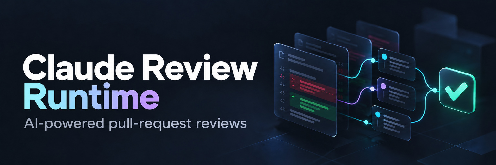

# Claude Review Runtime

Reusable GitHub Actions workflows for Claude pull-request reviews, built on
[Anthropic’s Claude Code Action](https://github.com/anthropics/claude-code-action).
The runtime captures the patch being reviewed, verifies model completion, and
uses separate trusted jobs to publish the Check and review status. These checks
help distinguish a completed review from a successful workflow that skipped it;
they do not establish exhaustive review quality or merge approval.

[Anthropic’s action](https://github.com/anthropics/claude-code-action) is a
general-purpose integration for reviews and other PR/issue tasks.
[DataDog’s code-review-action](https://github.com/DataDog/code-review-action)
is another reusable review option. Both are credible alternatives to evaluate
against your setup and trust requirements. This runtime focuses on captured-patch
identity, explicit completion checks, and controlled status publication; the
bounded experiments do not establish universal quality or security superiority.

## Set up a consumer

Start with the [consumer guide](docs/consumer-workflows.md): it contains the
prerequisites and three copyable callers for automatic review, manual requests,
and stale-status updates. Pin all three to the same reviewed full runtime SHA.
Model authentication requires `CLAUDE_CODE_OAUTH_TOKEN`; this runtime does not
accept `ANTHROPIC_API_KEY`. GitHub authentication separately uses the Anthropic
Claude GitHub App and default OIDC exchange.

Used by [Ballin](https://github.com/JBallin/ballin-scripts): see its
[manual caller example](https://github.com/JBallin/ballin-scripts/blob/main/.github/workflows/claude.yml)
and [verified manual-review evidence](https://github.com/JBallin/claude-review-runtime/issues/29#issuecomment-5974625017).

The Ballin evidence confirms one manual review. Broader public-consumer coverage,
other-owner, fork, and GitHub Enterprise Server configurations remain unvalidated.

## Read the result

Use the exact-head `Claude Review` Check together with the workflow run. Inline
comments contain findings; the status comment and top-level PR reactions show
progress and may become stale after a patch change. Request a fresh manual review
when the diff changes. The [review guide](docs/review-guide.md) explains commands,
clean-completion notices, failures, trust boundaries, and rollback.

## Validation and status

This is an experimental runtime with no commitment to ongoing support.
The [validation summary](docs/validation.md) distinguishes tested revisions from
the deployed callers and remaining gaps.
The pinned callers include confirmed finding publication and sanitized Read
coverage diagnostics. A verified Check establishes those runtime contracts; keep
independent review requirements in place.

The current source includes 319 passing offline tests, including bounded
restoration and recovery regressions. The validation summary records the exact
tested revision and the remaining platform and concurrency limits. Source
availability does not establish broad public-consumer or other-owner support.
Consumers retain their own pins until a separate reviewed adoption updates them.
